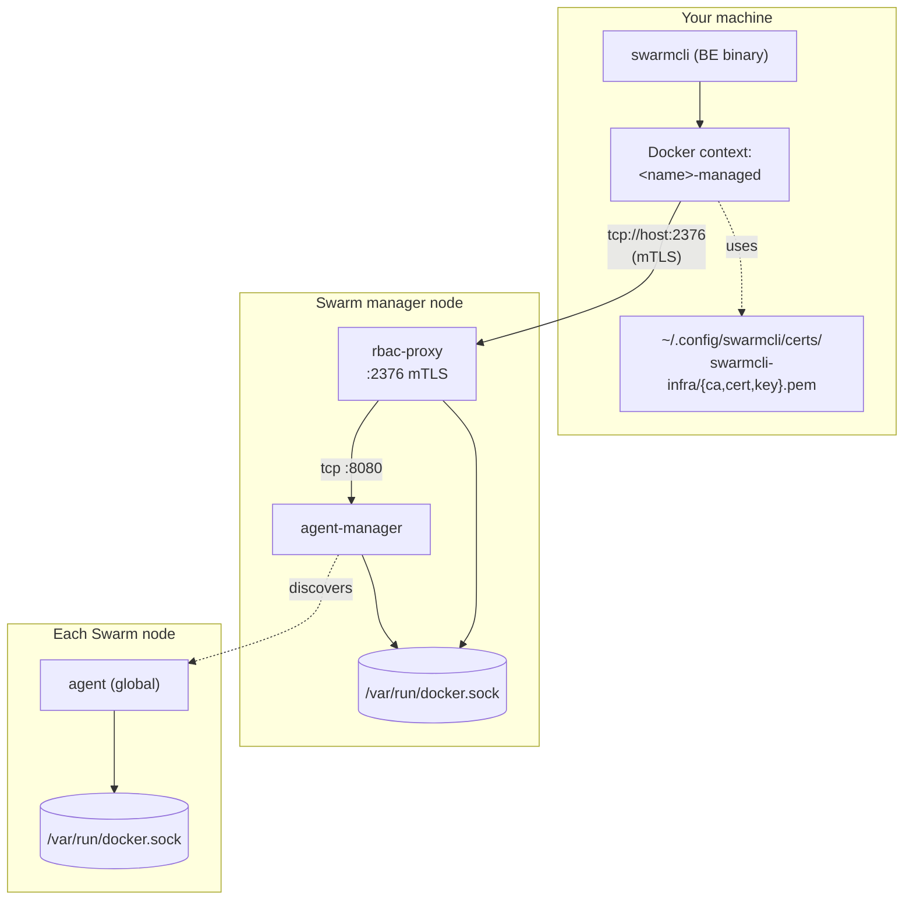

# Bootstrap

The `:bootstrap` command turns a vanilla Docker Swarm into a managed Swarm in
one shot: it generates an mTLS PKI, provisions Docker secrets, deploys the
SwarmCLI infrastructure stack (rbac-proxy + agent + agent-manager), and
registers a Docker context that talks to the cluster through the proxy.

After bootstrap, the rbac-proxy stands between you and the Docker Engine API.
Identity is established by client certificate; authorization is enforced by
role. This is what unlocks Business Edition's per-user shell and reveal-secret
features — see [`features.md`](features.md) for what they do, and
[`rbac.md`](rbac.md) for how to add additional users.

## What gets deployed



The bootstrap command creates the following artifacts:

**Stack** `swarmcli-infra`, three services:

- `rbac-proxy` — mTLS-fronted Docker API proxy. Listens on the chosen port
  (default `2376`). One replica, pinned to a manager node. Uses a SQLite
  store on the `proxy-data` volume for users and roles.
- `agent` — runs on every node (`mode: global`). Used by Business Edition
  features that need per-node access (interactive shell, secret reveal).
- `agent-manager` — one replica on a manager. Companion to `agent`: the
  rbac-proxy connects here on port `8080` to locate and reach per-node
  agents over the overlay.

**Network** `swarmcli-agent-net` — encrypted, internal overlay shared by all
three services. Protected against accidental deletion from the TUI.

**Docker secrets** (prefixed with the stack name, default `swarmcli-infra_`):

| Secret | Contents |
|---|---|
| `_ca-cert` | CA certificate (PEM) |
| `_ca-key` | CA private key (PEM) |
| `_server-cert` | Proxy server certificate (PEM) |
| `_server-key` | Proxy server private key (PEM) |
| `_admin-token` | Bearer token for the proxy's management API |

The admin token is delivered as a secret (not an environment variable) so it
cannot be read with `docker service inspect`.

**Local files** under `~/.config/swarmcli/certs/swarmcli-infra/` (mode `0600`,
directory `0700`):

- `ca.pem` — copy of the CA cert
- `cert.pem` — admin client certificate
- `key.pem` — admin client private key

**Docker context** named `<current-context>-managed` (e.g.
`default-managed`), pointing at `tcp://<host>:<port>` and configured with the
three cert files above.

## Prerequisites

- A Docker host with Swarm mode active (`docker info | grep -i swarm`).
- The current Docker context must connect to a Swarm manager — bootstrap
  needs to deploy a stack and create secrets.
- Free TCP port (default `2376`) on the manager you choose for the proxy.
- The current context must **not** itself be a managed context. Bootstrap
  refuses to run through the proxy. Switch back with `:contexts` first.
- Cryptographic curves used: ECDSA P-256 for all certificates. The CA is
  valid for 10 years; the server and client certs are valid for 1 year and
  must be re-issued (re-bootstrap or re-onboard the affected user) before
  expiry.

## Walkthrough

```text
1.  Open a SwarmCLI session pointing at your Swarm:
      swarmcli

2.  Run bootstrap:
      :bootstrap

3.  Confirm the host and port:
      Proxy host: <auto-detected manager IP>
      Proxy port: 2376

    Press Tab to switch fields, Enter to start, Esc to cancel.

4.  Wait for the run to complete. The view reports success or the
    underlying error.

5.  Switch to the new context:
      :contexts  →  select "<original>-managed"

    SwarmCLI is now talking through the proxy with the admin client cert.
```

To skip the interactive prompt, pass `--port`:

```text
:bootstrap --port 2376
```

## CLI flags

| Flag | Effect |
|---|---|
| `--check` | Report which infra services are running. Always allowed, including from a managed context. |
| `--port N` | Use port `N` (1–65535). Skips the interactive prompt. |
| `--host H` | Pre-fill or override the proxy host. Pre-fills the field in the interactive prompt; combined with `--port`, runs unattended. See [Host autodetection](#host-autodetection). |
| `--force` | Redeploy even if the stack is already running. **Not recommended on a live cluster** — see [Re-bootstrap](#re-bootstrap-and-teardown). |

## Host autodetection

`:bootstrap` derives the proxy host from the first manager node's advertised
`Status.Addr` (the address the node uses to talk to the rest of the swarm).
You can see the same value with `docker node ls` and `docker node inspect`.
For most production setups this is the right answer: it is the IP that
other nodes use to reach the manager, and it is reachable from your
workstation as long as routing and firewalling between you and the cluster
are in place. If no manager address can be determined, bootstrap falls back
to `127.0.0.1`.

Override with `--host` (or by editing the value in the prompt) when:

- The manager is behind NAT or a load balancer, and you need to point at the
  externally reachable address instead of the in-cluster IP.
- The manager has multiple network interfaces and the auto-detected one is
  not the one you want clients to use.
- You are running against a containerised dev environment where the
  in-cluster IP is not routable from your host.

The host you choose ends up in two places:

- The `tcp://<host>:<port>` endpoint of the new Docker context — i.e. the
  address every TUI session uses to reach the proxy.
- The Subject Alternative Name on the server certificate. If the value
  parses as an IP it becomes an IP SAN; otherwise it becomes a DNS SAN.
  Either way, changing the host later means the cert no longer matches and
  clients will refuse to connect — you would need to re-bootstrap (or
  reissue the server cert).

## After bootstrap

Verify the deployment:

```bash
docker service ls --filter label=com.docker.stack.namespace=swarmcli-infra
```

You should see `swarmcli-infra_rbac-proxy`, `_agent`, and `_agent-manager`,
all with their replicas converged.

Inside the TUI, `:bootstrap --check` does the same check and reports each
component's status.

The new context is also visible via:

```bash
docker context ls
```

Switch to it from the TUI with `:contexts`. SwarmCLI picks up the managed
context's client certificate automatically — no environment variables to
set. From then on, every Docker API call goes through the rbac-proxy and
is authenticated as `admin`.

To add additional users with their own certificates and roles, see
[`rbac.md`](rbac.md).

## Re-bootstrap and teardown

Bootstrap is idempotent in the safe direction: if the stack is already
running, the command refuses to redeploy and prints a hint about `--force`.

`--force` is destructive and should be reserved for development and CI
environments. It deletes the existing TLS/admin-token secrets before
recreating them, which:

- Invalidates the existing admin client certificate (you lose access to the
  managed context until you re-import it).
- Invalidates every user certificate previously issued by the proxy
  (everyone needs to be re-onboarded).
- Drops nothing in the SQLite store unless you also remove the `proxy-data`
  volume — the existing user/role records survive but their certs no longer
  validate against the new CA.

If you genuinely want to start over on a live cluster, the explicit path is:

```bash
docker stack rm swarmcli-infra
docker volume rm swarmcli-infra_proxy-data    # only if you also want to drop users/roles
docker context rm <original>-managed
rm -rf ~/.config/swarmcli/certs/swarmcli-infra
```

…then run `:bootstrap` again. Doing it this way keeps the destructive steps
visible and reviewable, and avoids partial states.

To remove the infra entirely, run the same four commands and stop there.

## Failure handling

`:bootstrap` performs the steps in order:

1. Refresh the swarm snapshot and detect existing infra.
2. Generate the admin token.
3. Generate the TLS bundle (CA + server cert + admin client cert).
4. Create the five Docker secrets.
5. Render and deploy the stack.
6. Write the local cert files.
7. Create the Docker context.

If any step after secret creation fails, bootstrap rolls back in reverse
order: it removes the context, removes the stack, deletes the secrets it
created, and removes the local cert directory. A failed run leaves your
cluster in the same state it was in before — no orphaned secrets, no
half-deployed stack, no stray context.

The error message identifies the failing step (snapshot refresh, secret
creation, stack deploy, context creation, …). The most common causes are
the proxy port being already in use on the manager, insufficient permissions
on the Docker socket, and trying to bootstrap from a context that is itself
already a managed context (caught by the guard before any work is done).
