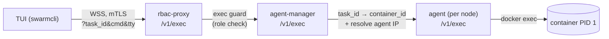

# Pro features

Two license-gated capabilities ride on top of the standard SwarmCLI TUI.
Both require:

- A valid (or in-grace) Business Edition license — see [License](license.md).
- A managed Docker context (i.e. a Swarm that has been put through
  [`:bootstrap`](bootstrap.md)). The features talk to the agent over the
  RBAC proxy; on a non-managed context they are unavailable.

## Shell into a service task

Press `x` on any row in the Services view to open an interactive shell
inside one of the service's running tasks.

If the service has multiple replicas, a picker dialog lists each running
task ("Replica N — hostname"). Use the arrow keys to choose, `Enter` to
confirm, `q` to cancel. Single-replica services skip the picker.

### Wire path



The exec guard on the rbac-proxy enforces the role gate: a non-admin
client cert gets `403 exec on protected stack requires admin role`. See
[RBAC — Roles](rbac.md#roles).

### Shell selection

If you don't override the command, the agent auto-detects an available
shell on the target container in this order:

1. `/bin/bash`
2. `/bin/sh`
3. `/bin/ash`

To force a specific command, set `SWARMCLI_SHELL_CMD` before launching
SwarmCLI:

```bash
SWARMCLI_SHELL_CMD=/usr/bin/zsh swarmcli
```

Once attached, the TUI propagates terminal resizes to the remote PTY via
control messages; window-resize handling is automatic.

### Failure modes

| What you see | Cause |
|---|---|
| `403 exec on protected stack requires admin role` | The current managed context's user is not an admin. Switch to an admin context. |
| Connection failed / WebSocket closed | The rbac-proxy is unreachable, or the agent-manager could not reach the per-node agent. Check `:bootstrap --check`. |
| `EXEC_ERROR: no shell available` | The container image lacks `bash`, `sh`, and `ash`. Set `SWARMCLI_SHELL_CMD` to an executable that does exist in the image. |
| `Service not found` / `task not running` | Task state changed between selection and exec. Refresh the view and retry. |

## Reveal a secret

Press `x` on a row in the Secrets view to reveal the secret's contents.

Docker Swarm intentionally provides no read API for secret material; the
only way to read a secret is to mount it into a running container.
SwarmCLI BE automates that pattern:

1. A short-lived service `swarmcli-reveal-<name>-<unix-ts>` is created,
   mounting the secret at `/run/secrets/<name>`.
2. The service runs `sh -c "cat /run/secrets/<name> && sleep 10"`.
3. SwarmCLI polls the service's logs every 300 ms for up to 20 seconds.
4. Output is parsed: if it looks like printable base64, the decoded form
   is shown alongside the raw value.
5. The temporary service is removed in a `defer` — even on error or
   timeout — so a failed reveal does not leave debris behind.

The image used for the temporary service is `alpine:latest` by default.
Override with `SWARMCLI_REVEAL_IMAGE` for offline environments or a
hardened base:

```bash
SWARMCLI_REVEAL_IMAGE=registry.example.com/internal/alpine:3.20 swarmcli
```

### Security notes

Reveal-secret is a debugging tool, not a vault read. While the operation
is in flight:

- The secret material lives in a container's filesystem at
  `/run/secrets/<name>`.
- The secret material is emitted to that container's stdout, which means
  it is visible to anyone with `docker service logs` access on the
  manager hosting the task.
- The temporary service is observable via `docker service ls` for
  ~20 seconds.

The same audit record applies as any other Swarm service create/remove —
the rbac-proxy logs the calls, and Docker's daemon audit (if any) does
likewise. If your threat model requires that secret material never leave
the manager's secret store, do not enable reveal-secret for users you
don't trust to read the cleartext.

### Failure modes

| What you see | Cause |
|---|---|
| "Reveal timed out — no output captured" | Image pull stalled, the node has no scheduling capacity, or the secret file is unreadable inside the container. The view will surface task diagnostics when present. |
| Image pull failure | `SWARMCLI_REVEAL_IMAGE` cannot be pulled by the node. Use an image already cached on the node, or pre-pull. |
| `Forbidden` (403) | A non-admin user is invoking reveal — the underlying `service create` is gated. Switch to an admin context. |

## Where the gates live

Both features are registered as gated actions:

- Shell: `features.IsEnabled(license.FeatureShell)`
- Reveal-secret: `features.IsEnabled(license.FeatureRevealSecret)`

Tier-to-feature mapping is centralised: today, both `be` and `trial`
tiers grant both features. See [License — Model](license.md#model).
