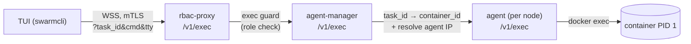
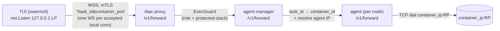

# Pro features

Three license-gated capabilities ride on top of the standard SwarmCLI TUI.
All three require:

- A valid (or in-grace) Business Edition license — see [License](license.md).
- A managed Docker context (i.e. a Swarm that has been put through
  [`:bootstrap`](bootstrap.md)). The features talk to the agent over the
  RBAC proxy; on a non-managed context they are unavailable.

## Shell into a service task

Press `x` on any row in the Services view to open an interactive shell
inside one of the service's running tasks.

If the service has multiple replicas, a picker dialog lists each running
task ("Replica N — hostname"). Use the arrow keys to choose, `Enter` to
confirm, `q` to cancel. Single-replica services skip the picker.

### Wire path



The exec guard on the rbac-proxy enforces the role gate: a non-admin
client cert gets `403 exec on protected stack requires admin role`. See
[RBAC — Roles](rbac.md#roles).

### Shell selection

If you don't override the command, the agent auto-detects an available
shell on the target container in this order:

1. `/bin/bash`
2. `/bin/sh`
3. `/bin/ash`

To force a specific command, set `SWARMCLI_SHELL_CMD` before launching
SwarmCLI:

```bash
SWARMCLI_SHELL_CMD=/usr/bin/zsh swarmcli
```

Once attached, the TUI propagates terminal resizes to the remote PTY via
control messages; window-resize handling is automatic.

### Failure modes

| What you see | Cause |
|---|---|
| `403 exec on protected stack requires admin role` | The current managed context's user is not an admin. Switch to an admin context. |
| Connection failed / WebSocket closed | The rbac-proxy is unreachable, or the agent-manager could not reach the per-node agent. Check `:bootstrap --check`. |
| `EXEC_ERROR: no shell available` | The container image lacks `bash`, `sh`, and `ash`. Set `SWARMCLI_SHELL_CMD` to an executable that does exist in the image. |
| `Service not found` / `task not running` | Task state changed between selection and exec. Refresh the view and retry. |

## Reveal a secret

Press `x` on a row in the Secrets view to reveal the secret's contents.

Docker Swarm intentionally provides no read API for secret material; the
only way to read a secret is to mount it into a running container.
SwarmCLI BE automates that pattern:

1. A short-lived service `swarmcli-reveal-<name>-<unix-ts>` is created,
   mounting the secret at `/run/secrets/<name>`.
2. The service runs `sh -c "cat /run/secrets/<name> && sleep 10"`.
3. SwarmCLI polls the service's logs every 300 ms for up to 20 seconds.
4. Output is parsed: if it looks like printable base64, the decoded form
   is shown alongside the raw value.
5. The temporary service is removed in a `defer` — even on error or
   timeout — so a failed reveal does not leave debris behind.

The image used for the temporary service is `alpine:latest` by default.
Override with `SWARMCLI_REVEAL_IMAGE` for offline environments or a
hardened base:

```bash
SWARMCLI_REVEAL_IMAGE=registry.example.com/internal/alpine:3.20 swarmcli
```

### Security notes

Reveal-secret is a debugging tool, not a vault read. While the operation
is in flight:

- The secret material lives in a container's filesystem at
  `/run/secrets/<name>`.
- The secret material is emitted to that container's stdout, which means
  it is visible to anyone with `docker service logs` access on the
  manager hosting the task.
- The temporary service is observable via `docker service ls` for
  ~20 seconds.

The same audit record applies as any other Swarm service create/remove —
the rbac-proxy logs the calls, and Docker's daemon audit (if any) does
likewise. If your threat model requires that secret material never leave
the manager's secret store, do not enable reveal-secret for users you
don't trust to read the cleartext.

### Failure modes

| What you see | Cause |
|---|---|
| "Reveal timed out — no output captured" | Image pull stalled, the node has no scheduling capacity, or the secret file is unreadable inside the container. The view will surface task diagnostics when present. |
| Image pull failure | `SWARMCLI_REVEAL_IMAGE` cannot be pulled by the node. Use an image already cached on the node, or pre-pull. |
| `Forbidden` (403) | A non-admin user is invoking reveal — the underlying `service create` is gated. Switch to an admin context. |

## Port-forward a container port

Press `w` on any row in the Services view to open a port-forward dialog,
or use the command bar: `:port-forward <service> <local>:<remote>`
(alias `:pf <service> <local>:<remote>`). This forwards a port on your
local machine to a port inside one of the service's running tasks —
analogous to `kubectl port-forward`.

If the service has multiple replicas a picker dialog lists each running
task; pick one and the forward targets that specific task. Single-replica
services skip the picker.

### Wire path



### Bind address policy

The local listener always binds `127.0.0.1`. This is **not** configurable
— exposing a forwarded internal service on `0.0.0.0` is too easy to do
by accident, especially on laptops on shared networks. If you need to
share a forwarded port with a teammate, use a separate tunnel.

Local ports below 1024 are rejected at validation time (they would
require root privileges and are easy to confuse with a system service).
Use a port in the 1024–65535 range, or pass `0` to let the OS pick an
ephemeral port — the chosen port is then displayed in the dialog.

### Managing active forwards

Open `:port-forwards` (alias `:pf`) to see a list of active forwards:

| Column | Meaning |
|--------|---------|
| Service / Slot / Node | The replica the forward is bound to. |
| Container | Truncated container ID. |
| `LP→RP` | `127.0.0.1:LOCAL → CONTAINER_PORT`. |
| State | `live`, `closing`, or `dead`. |
| Bytes In / Out | Cumulative byte counts since the forward was opened. |
| Conns | Currently open TCP connections through this forward. |

Hotkeys in the list view: `Enter` inspect, `d` close, `r` close + reopen
with the same ports.

### Lifecycle

A forward stays alive for the lifetime of the SwarmCLI process. Closing
the dialog or navigating away from the list view does **not** tear it
down — only an explicit `d` (close) or quitting the TUI ends a forward.
On quit, every listener is drained and every WebSocket is closed cleanly
before the process exits.

A forward does not survive these events:

- **Container restart or reschedule.** The forward dies; reopen it (the
  new task may live on a different node, so silent re-resolution would
  hide intent).
- **Agent restart or unreachable.** The forward dies; the local listener
  is closed so subsequent connection attempts fail loudly rather than
  blackholing.
- **30 minutes of zero traffic.** The idle timeout closes the forward.
  Override via `SWARMCLI_FORWARD_IDLE_TIMEOUT` (capped at 24 h).

### Permissions

Forwarding to a task on the **protected (infrastructure) stack** is
denied for **every external role — including admin**. This is stricter
than exec, where admins are allowed: a long-lived TCP tunnel through
the proxy you administer is a foot-gun and an exfil channel an
admin-cert compromise could exploit. Legitimate admin port-forwarding
into infrastructure must use the host Docker socket on a manager node
or the internal listener.

Forwarding to any non-protected task is allowed for all authenticated
users (same as exec).

See [RBAC — Roles](rbac.md#roles).

### Failure modes

| What you see | Cause |
|---|---|
| `Port-forward requires Business Edition` | No valid license; open `:license`. |
| `Permission denied: forwarding to <stack> requires admin role` | Non-admin user attempting to forward to a non-admin-allowed target. Use a different context. |
| `forward on protected stack is not permitted` | Even an admin has tried to forward to the infrastructure stack. Use the host Docker socket or internal listener. |
| `local port N is already in use` | Choose another port, or pass `0` for an OS-assigned ephemeral port. |
| `local ports below 1024 are not supported; pick 1024–65535` | Use a non-privileged port. |
| `forward closed: target port not reachable` | The container is up but nothing is listening on that port — typo, or the service hasn't bound yet. |
| `forward closed: agent disconnected` | The on-node agent is down or the overlay path broke. Check `:bootstrap --check`. |
| `forward target task is no longer running` | The container restarted or moved nodes. Reopen the forward. |

## Where the gates live

All three features are registered as gated actions:

- Shell: `features.IsEnabled(license.FeatureShell)`
- Reveal-secret: `features.IsEnabled(license.FeatureRevealSecret)`
- Port-forward: `features.IsEnabled(license.FeaturePortForward)`

Tier-to-feature mapping is centralised: today, both `be` and `trial`
tiers grant all three features. See [License — Model](license.md#model).
