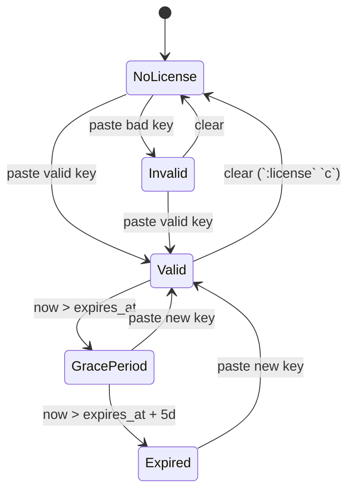

# License

SwarmCLI Business Edition runs against a signed license key. This page
covers the model, the activation paths, and the lifecycle states a key
goes through.

## Model

A license key is `base64(payload).base64(signature)`, where `payload` is
JSON, signed with Ed25519. The verifier (the `swarmcli` binary) carries
the corresponding public key. Keys are stamped with a `version` field;
the binary accepts versions in `[MinSchemaVersion, SchemaVersion]`, so
additive payload changes don't invalidate keys already in the wild.

The payload carries:

- `customer_id` — your customer identifier.
- `tier` — `be` (Business Edition) or `trial`. Both grant the same feature
  set today; `trial` is intended to be combined with a short `expires_at`.
- `expires_at` — optional ISO-8601 timestamp. Omit for a non-expiring key.
- `max_nodes` / `max_users` — optional limits (`0` = unlimited). See
  [Limits](#limits).
- `version` — schema version (`1` today).

There is no `features` field in the payload — entitlements are derived
from the tier. This means adding a capability to a tier benefits every
outstanding key for that tier without re-issuing.

## Acquiring a key

Get a key (including a free trial) at [swarmcli.io/be](https://swarmcli.io/be).

## Activation

Three input paths are checked in this order:

1. The `SWARMCLI_LICENSE` environment variable.
2. The file `~/.config/swarmcli/license.key`.
3. The interactive startup prompt.

If `SWARMCLI_LICENSE` is set, the file is **not** read — the env var is
authoritative. If both are absent, swarmcli shows the startup prompt.

You can also set or replace the active key from inside the TUI: open
`:license` and press `s` to paste a new key, or `c` to clear the current
one. A key set this way is written to `~/.config/swarmcli/license.key`.

### Startup prompt

The prompt appears whenever no usable key is available — i.e. there's no
key, the key is invalid, or the key is past its grace period. You see one
of:

```
No Business Edition license found.

Get a free trial license at: https://swarmcli.io/be

Paste your license key below, or press Enter to continue
with Community Edition.

You can also set the SWARMCLI_LICENSE environment variable.

License key:
```

```
Your license key is invalid.

Paste a valid license key below, or press Enter to continue
with Community Edition.

License key:
```

```
Your license expired on YYYY-MM-DD. The 5-day grace period has ended.
Business Edition features are now disabled.

Paste a new license key below, or press Enter to continue
with Community Edition.

License key:
```

Pressing **Enter** with no input drops you into Community Edition mode for
this session. Pasting a valid key activates BE and saves the key to
`~/.config/swarmcli/license.key`.

There is no flag to skip the prompt non-interactively — set
`SWARMCLI_LICENSE` instead, or pre-place the file. Piping an empty line
to stdin will still bypass the prompt, but the TUI itself requires a
real terminal.

### `:license` view

Inside the TUI, `:license` shows current state:

| Shown | Meaning |
|---|---|
| Status: Valid | Key verified, not expired, within limits. |
| Status: Grace Period (N days remaining) | Key expired, features still enabled (see below). |
| Status: Expired | Key past grace; features disabled. |
| Status: No license | No key present. |
| Status: Invalid | Signature mismatch, malformed payload, or unknown tier. |
| Status: Node limit exceeded | Cluster has more nodes than `max_nodes`. |
| Status: User limit exceeded | RBAC store has more users than `max_users`. |

Key bindings inside the view:

- `s` — set a new license key (interactive paste).
- `c` — clear the current key (with confirmation).

## Lifecycle states



| State | BE features | What the user sees |
|---|---|---|
| Valid | enabled | normal startup, no prompt |
| Grace Period | **enabled** | one-line warning printed to stderr at startup, banner in `:license` view |
| Expired (past grace) | disabled | startup prompt every run until a new key is provided |
| No license | disabled | startup prompt every run |
| Invalid | disabled | startup prompt every run |

The grace period is **5 days** from `expires_at`. During grace, BE
features remain enabled — this is deliberate, so a quiet renewal cycle
doesn't take a production cluster offline.

## Limits

`max_nodes` and `max_users` are **soft** limits. Exceeding them does not
block any operation; they appear as a warning state in the `:license`
view, and the warning is stamped on the license payload at issuance time.

- `max_nodes` is checked against the swarm's current node count, refreshed
  on each TUI update tick.
- `max_users` is checked against the rbac-proxy's user store after each
  RBAC change.

Either limit set to `0` is treated as unlimited.

## Schema versioning

- `SchemaVersion` is the version stamped onto new keys.
- `MinSchemaVersion` is the lowest version the verifier accepts.

Both are `1` today. Additive changes (e.g. a new optional field) bump
`SchemaVersion` only, so old keys remain valid. A breaking change requires
bumping `MinSchemaVersion`, which intentionally rejects older payloads.

## Privacy

The license key itself never leaves your machine after activation. The
verification is local: the binary holds the public key, parses the
payload, and checks the signature. No network call is made for license
validation. The unrelated CE version-check behaviour (a single GET to
`https://swarmcli.io/api/v1/version` at startup) can be disabled with
`SWARMCLI_DISABLE_VERSION_CHECK=true`; see the
[swarmcli README](https://github.com/Eldara-Tech/swarmcli#environment-variables).

## Dev override

For development and testing, you can override the embedded public key
with `SWARMCLI_LICENSE_PUBKEY=<base64-pubkey>`. The override is honoured
**only** when `SWARMCLI_ENV=dev`. In production builds it is ignored.
