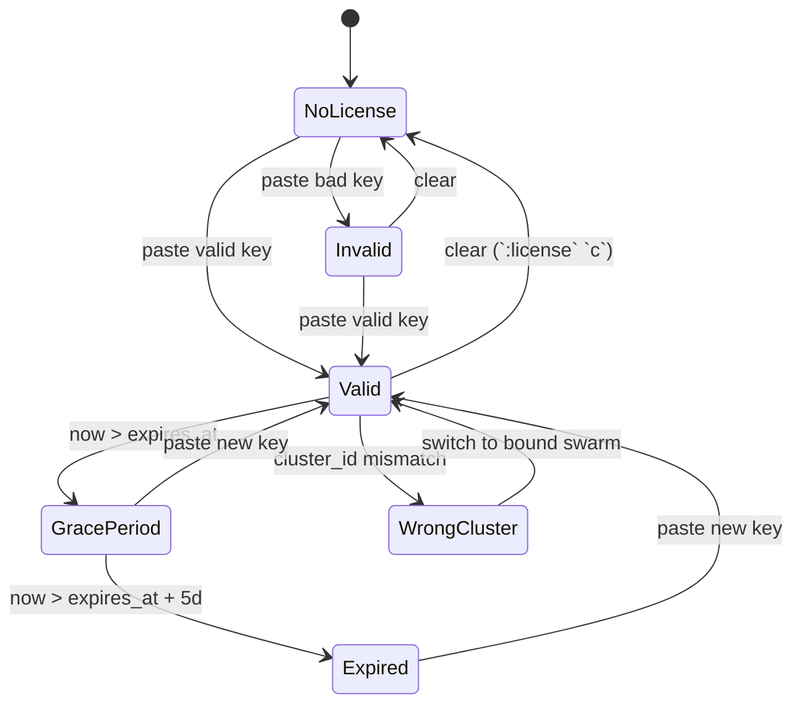

# License

SwarmCLI Business Edition runs against a signed license key. This page
covers the model, the activation paths, and the lifecycle states a key
goes through.

## Model

A license key is `base64(payload).base64(signature)`, where `payload` is
JSON, signed with Ed25519. The verifier (the `swarmcli` binary) carries
the corresponding public key. Keys are stamped with a `version` field;
the binary accepts versions in `[MinSchemaVersion, SchemaVersion]`, so
additive payload changes don't invalidate keys already in the wild.

The payload carries:

- `customer_id` — your customer identifier.
- `tier` — `be` (Business Edition) or `trial`. Both grant the same feature
  set today; `trial` is intended to be combined with a short `expires_at`.
- `expires_at` — optional ISO-8601 timestamp. Omit for a non-expiring key.
- `max_nodes` / `max_users` — optional limits (`0` = unlimited). See
  [Limits](#limits).
- `cluster_id` — optional swarm cluster id this key is bound to. When
  set, the key only verifies on the matching swarm. Omit for a
  portable key. See [Per-swarm binding](#per-swarm-binding).
- `version` — schema version (`2` today).

There is no `features` field in the payload — entitlements are derived
from the tier. This means adding a capability to a tier benefits every
outstanding key for that tier without re-issuing.

## Acquiring a key

Get a key (including a free trial) at [swarmcli.io/be](https://swarmcli.io/be).

## Activation

Input paths are checked in this order:

1. The `SWARMCLI_LICENSE` environment variable.
2. A Docker Config named `swarmcli-license` on the connected swarm (the
   recommended place; see [Per-swarm storage](#per-swarm-storage)).
3. The file `~/.config/swarmcli/license.key`.
4. The interactive startup prompt.

If a higher-priority path yields a key, lower paths are **not** consulted.
If all are absent, swarmcli shows the startup prompt.

You can also set or replace the active key from inside the TUI: open
`:license` and press `s` to paste a new key, or `c` to clear the current
one. A key set this way is written to `~/.config/swarmcli/license.key`.
To install a key directly into the connected swarm (recommended for
deployed environments), use `:license install <path-to-license.key>`
from the command bar — see [`:license` subcommands](#license-subcommands).

### Startup prompt

The prompt appears whenever no usable key is available — i.e. there's no
key, the key is invalid, or the key is past its grace period. You see one
of:

```
No Business Edition license found.

Get a free trial license at: https://swarmcli.io/be

Paste your license key below, or press Enter to continue
with Community Edition.

You can also set the SWARMCLI_LICENSE environment variable.

License key:
```

```
Your license key is invalid.

Paste a valid license key below, or press Enter to continue
with Community Edition.

License key:
```

```
Your license expired on YYYY-MM-DD. The 5-day grace period has ended.
Business Edition features are now disabled.

Paste a new license key below, or press Enter to continue
with Community Edition.

License key:
```

```
This license is bound to swarm <expected-id>.
You are connected to swarm <observed-id>.
Business Edition features are disabled.
Switch context (:contexts) or contact support to rebind.

License key:
```

Pressing **Enter** with no input drops you into Community Edition mode for
this session. Pasting a valid key activates BE and saves the key to
`~/.config/swarmcli/license.key`.

There is no flag to skip the prompt non-interactively — set
`SWARMCLI_LICENSE` instead, or pre-place the file. Piping an empty line
to stdin will still bypass the prompt, but the TUI itself requires a
real terminal.

### `:license` view

Inside the TUI, `:license` shows current state:

| Shown | Meaning |
|---|---|
| Status: Valid | Key verified, not expired, within limits, bound swarm matches (or unbound). |
| Status: Grace Period (N days remaining) | Key expired, features still enabled (see below). |
| Status: Expired | Key past grace; features disabled. |
| Status: No license | No key present. |
| Status: Invalid | Signature mismatch, malformed payload, or unknown tier. |
| Status: Node limit exceeded | Cluster has more nodes than `max_nodes`. |
| Status: User limit exceeded | RBAC store has more users than `max_users`. |
| Status: Wrong swarm (license bound to a different cluster) | The connected swarm differs from the one the license is bound to. See [Per-swarm binding](#per-swarm-binding). |

The view also shows:

- `Source: environment variable | swarm config (swarmcli-license) | file (~/.config/swarmcli/license.key)` — where the active key was loaded from.
- `Binding: Bound to <id> | Unbound (portable across swarms) | Expected/Observed mismatch` — the current binding state.

Key bindings inside the view:

- `s` — set a new license key (interactive paste, written to `~/.config/swarmcli/license.key`).
- `c` — clear the current key (with confirmation; clears env, swarm config, **and** file).

### `:license` subcommands

| Command | Effect |
|---|---|
| `:license` | Open the license view (default). |
| `:license install <file>` | Install the token in `<file>` into this swarm's Docker Config (`swarmcli-license`). The token is validated before it is stored. Requires a Docker context pointing at a swarm manager. |
| `:license uninstall` | Remove the swarm-stored license. Does not touch the env var or the file fallback — if a file or env var is still set, the license stays active from that source. |
| `:license cluster-id` | Print the current swarm's cluster id (useful when contacting support to get a bound license issued). Works with no license loaded. |

`:license install` refuses to overwrite an existing managed config — run
`:license uninstall` first. It also won't touch a `swarmcli-license`
Config that swarmcli didn't create, so a user-created Config of the same
name is never silently overwritten.

## Per-swarm binding

A license payload may include an optional `cluster_id` field that pins it
to a single Docker Swarm. There are three cases:

- **Unbound** (`cluster_id` absent): the key verifies on any swarm. This
  is the legacy / portable behaviour; `trial` keys are typically unbound.
- **Bound, matching**: business as usual.
- **Bound, mismatching**: the key is cryptographically valid but is for a
  different swarm. Business Edition features disable and `:license` shows
  `Wrong swarm`; switching back to the bound swarm restores it immediately,
  with no waiting period. If you legitimately need to operate against
  another swarm, get a license issued for that swarm.

### Getting a bound license

Run `:license cluster-id` in swarmcli to see your swarm's id, send that
to support along with your account information, and you'll receive a
bound license file. Install it with `:license install <file>`.

### My cluster was rebuilt — what now?

When a swarm is destroyed and a new one initialized (`docker swarm leave
--force` then `docker swarm init`), the cluster id changes. Your bound
license will not verify against the new cluster.

Resolution: contact support with the new cluster id (`:license
cluster-id` against the new swarm) — sales will reissue a license bound
to the new id. Install the replacement with `:license install <file>`.

Force-restoring a swarm from a backup of `/var/lib/docker/swarm/` (a
documented DR procedure with `docker swarm init --force-new-cluster`)
preserves the cluster id, so the original license keeps working.

## Per-swarm storage

The license can be stored as a Docker Config (`swarmcli-license`) on the
swarm itself. This is the recommended deployment pattern:

- The license is part of the swarm's Raft state. It's not sitting in a
  file on operator laptops.
- Any operator with a docker context pointing at the swarm reads the
  same license — no per-engineer setup.
- Removing a docker context removes that engineer's access to the
  license (after the next swarmcli restart).

Install with `:license install <file>`. swarmcli marks the Config as its
own so it can distinguish it from any user-created Config of the same name.

### MSPs / consultancies

If you manage swarms for multiple customers, install the customer's
license once into each customer's swarm. Your engineers carry zero
license files — picking the right `docker context` is enough. New
engineers joining the team inherit license access by inheriting docker
contexts, with no extra issuance.

This replaces the older pattern of curating one license file per
customer on each engineer's laptop.

## Lifecycle states



| State | BE features | What the user sees |
|---|---|---|
| Valid | enabled | normal startup, no prompt |
| Grace Period | **enabled** | one-line warning printed to stderr at startup, banner in `:license` view |
| Expired (past grace) | disabled | startup prompt every run until a new key is provided |
| No license | disabled | startup prompt every run |
| Invalid | disabled | startup prompt every run |
| Wrong swarm | disabled | startup prompt naming the expected vs. observed cluster id |

The grace period is **5 days** from `expires_at`. During grace, BE
features remain enabled — this is deliberate, so a quiet renewal cycle
doesn't take a production cluster offline.

## Limits

`max_nodes` and `max_users` are **soft** limits. Exceeding them does not
block any operation; they appear as a warning state in the `:license`
view, and the warning is stamped on the license payload at issuance time.

- `max_nodes` is checked against the swarm's current node count, refreshed
  on each TUI update tick.
- `max_users` is checked against the rbac-proxy's user store after each
  RBAC change.

Either limit set to `0` is treated as unlimited.

## Schema versioning

- `SchemaVersion` is the version stamped onto new keys (`2` today).
- `MinSchemaVersion` is the lowest version the verifier accepts (`1` today).

Additive changes (e.g. a new optional field) bump `SchemaVersion` only,
so old keys remain valid. A breaking change requires bumping
`MinSchemaVersion`, which intentionally rejects older payloads.

Version 2 added the optional `cluster_id` field for per-swarm binding;
version 1 keys remain valid and behave as "unbound" (portable across
swarms).

## Privacy

The license key itself never leaves your machine after activation. The
verification is local: the binary holds the public key, parses the
payload, and checks the signature. No network call is made for license
validation. The unrelated CE version-check behaviour (a single GET to
`https://swarmcli.io/api/v1/version` at startup) can be disabled with
`SWARMCLI_DISABLE_VERSION_CHECK=true`; see the
[swarmcli README](https://github.com/Eldara-Tech/swarmcli#environment-variables).

## Dev override

For development and testing, you can override the embedded public key
with `SWARMCLI_LICENSE_PUBKEY=<base64-pubkey>`. The override is honoured
**only** when `SWARMCLI_ENV=dev`. In production builds it is ignored.
