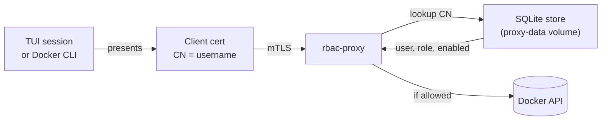

# RBAC: users, roles, onboarding

After [`:bootstrap`](bootstrap.md), every Docker API call you make from
SwarmCLI flows through the rbac-proxy. The proxy authenticates every
request by client certificate and authorises it by role. This page covers
adding additional users, the role model, and revocation.

## Identity model



A request is authenticated if and only if:

1. The client cert chains to the bootstrap CA.
2. The cert's Common Name resolves to a user record in the proxy's store.
3. That user record is **enabled**.

Disabled or missing users get **403** before any Docker API call.

## Roles

Two roles are defined: `admin` and `user`.

| Capability | `admin` | `user` |
|---|---|---|
| Read API (list, inspect, logs) | ✓ | ✓ |
| Service create / update / remove on protected stack | ✓ | ✗ (403) |
| Exec / attach into a service task on protected stack | ✓ | ✗ (403) |
| Exec / attach into a non-protected service task | ✓ | ✓ |
| Port-forward (`:port-forward`) to a non-protected service task | ✓ | ✓ |
| Port-forward to a service task on protected stack | ✗ | ✗ |
| Connect a container to / disconnect from the bootstrap overlay (`swarmcli-agent-net`) | ✗ | ✗ |
| `docker swarm leave` | ✗ | ✗ |

The "protected stack" is the bootstrap stack itself (default
`swarmcli-infra`). Read-only operations are unrestricted; mutations and
exec into the proxy/agent infrastructure are blocked for non-admins, and
**port-forwarding into the protected stack is blocked even for admins**
— a long-lived TCP tunnel through the proxy you administer is a foot-gun
and an exfil channel an admin-cert compromise could exploit (same
rationale as the network-pivot block). Network-pivot, swarm-leave, and
protected-stack port-forward are blocked for **everyone** going through
the proxy — these are guards against admin-cert compromise, not role
gates.

The bootstrap admin user (default username `admin`) is created at proxy
startup from the `PROXY_SEED_USERNAME` / `PROXY_SEED_ROLE` env vars in the
deployed stack. The matching client certificate is generated by
`:bootstrap` itself and written to your local `~/.config/swarmcli/certs/`
— no onboarding URL is involved for the admin.

## The `swcproxy` CLI

User management is performed inside the rbac-proxy container. Get a shell:

```bash
docker exec -it $(docker ps -q -f name=swarmcli-infra_rbac-proxy.1) sh
```

Subcommands:

| Command | Purpose |
|---|---|
| `swcproxy user ls` | List users (`USERNAME`, `ROLE`, `ENABLED`, `CREATED`). |
| `swcproxy user add <name> [--admin]` | Create a user (role `user`, or `admin` with the flag). Prints an onboarding token + `curl` + `docker context import` snippet. |
| `swcproxy user delete <name>` | Remove a user from the store. See [Revocation](#revocation). |
| `swcproxy user regenerate-token <name>` | Issue a fresh onboarding token for an existing user. Use this for the bootstrap admin or when an onboarding token has expired. |
| `swcproxy audit ls [--limit N]` | List the audit log (default 50). |

All commands operate on the SQLite store mounted on the `proxy-data`
volume. Changes take effect immediately.

## Onboarding a new user

End-to-end: from an admin terminal, with `<proxy-host>:<port>` being the
external URL of the rbac-proxy (the same one used by your managed Docker
context).

```bash
# 1. Open a shell in the rbac-proxy container.
docker exec -it $(docker ps -q -f name=swarmcli-infra_rbac-proxy.1) sh

# 2. Inside the container: create the user.
swcproxy user add alice            # role: user
# or
swcproxy user add alice --admin    # role: admin

# Output (paraphrased):
#   Onboard token: 5f2c…a8
#   curl -k https://<proxy-host>:2376/api/v1/onboard/5f2c…a8 -o alice.tar
#   docker context import alice-managed alice.tar

# 3. Exit the container.
exit

# 4. From the user's machine, fetch and import:
curl -k https://<proxy-host>:2376/api/v1/onboard/<token> -o alice.tar
docker context import alice-managed alice.tar

# 5. The user can now use the new context.
docker context use alice-managed
swarmcli
```

The tar produced by the onboard endpoint contains:

- `meta.json` — Docker context metadata (name `<username>-managed`,
  endpoint URL).
- `tls/docker/ca.pem` — the bootstrap CA.
- `tls/docker/cert.pem` — the user's freshly-issued client cert
  (Subject CN = username, ECDSA P-256).
- `tls/docker/key.pem` — the matching private key.

### Onboarding token lifetime

Tokens expire **24 hours** after they are issued (default; configurable
on the proxy via `PROXY_ONBOARDING_TOKEN_TTL`). Tokens are also
**single-use**: once consumed, the same URL no longer works.

If the user did not import the bundle in time, run
`swcproxy user regenerate-token <name>` to get a fresh URL.

## Switching roles inside the TUI

A managed Docker context carries a single user's certificate. To exercise
a different role, switch contexts:

```text
:contexts  →  select the context for the user/role you want
```

SwarmCLI picks up the certificate of the new context for every subsequent
Docker API call and shell connection — no environment variables to set.

This is also the easiest way to verify your RBAC configuration: import a
non-admin user, switch to that context, try `x` on a service. You should
get a 403; switching back to an admin context unblocks it.

## Revocation

`swcproxy user delete <name>` removes the user record from the store.
The rbac-proxy looks up the cert's CN on every request, so a deleted
user gets a 403 immediately on the next call — even though the
certificate itself is still cryptographically valid.

There is intentionally no certificate revocation list (CRL) in this
design: the cert lifetime is bounded (1 year), and the user-record
lookup is the authoritative gate. To make a previously-issued cert
unusable today, delete the user record. To rotate everyone (e.g. after
a suspected CA compromise), re-bootstrap with `--force` — note the
caveats in [Bootstrap — Re-bootstrap](bootstrap.md#re-bootstrap-and-teardown).

A user can also be **disabled** (kept in the store but blocked) by toggling
the `enabled` flag in the store. The `swcproxy` CLI does not currently
expose a one-shot "disable" subcommand; if you need one, deletion + later
re-add is the pragmatic path.

## Auditability

Every API call through the rbac-proxy is recorded; `swcproxy audit ls`
shows the most recent entries. Audit retention is bounded by the
`proxy-data` volume — back up the volume if you need long-term retention.
