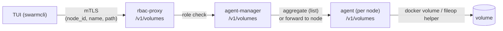

# Volumes

The Volumes view lists Docker volumes and — on Business Edition — lets you
manage them across the whole swarm. The read-only view is part of the base
TUI; listing volumes on **all** nodes and the create / delete / prune / file-browse
actions are license-gated and require a managed context.

Open it from the command bar:

```text
:volume
```

What you can do depends on two things:

- **License.** The `volumes-all-nodes` entitlement (granted on the `be` and
  `trial` tiers — see [License](license.md)) unlocks cross-node listing and all
  management actions.
- **Context.** Cross-node operations talk to the per-node agents through the
  RBAC proxy, so they need a managed Docker context (a swarm that has been put
  through [`:bootstrap`](bootstrap.md)). On a non-managed context the view falls
  back to the connected node only.

## The Volumes view

The list has six columns:

| Column | Meaning |
|---|---|
| NAME | Volume name. |
| STACK | Owning stack (from the `com.docker.stack.namespace` label), or `-`. |
| DRIVER | Volume driver (`local`, …). |
| MOUNT POINT | On-disk path of the volume on its node. |
| CREATED | Creation timestamp. |
| HOST | The node the volume lives on. |

Navigation and inspection:

| Key | Action |
|---|---|
| `↑`/`↓` (`k`/`j`) | Move cursor |
| `pgup` / `pgdown` | Page up / down |
| `i` / `enter` | Inspect the selected volume (JSON viewer) |
| `/` | Filter (matches name, stack, driver, mount point, host) |
| `?` | Full help |
| `esc` / `q` | Back |

Sort with `shift`+ the column initial; press the same key again to flip the
direction:

| Key | Sort by |
|---|---|
| `shift+n` | Name |
| `shift+s` | Stack |
| `shift+d` | Driver |
| `shift+c` | Created |
| `shift+h` | Host |

### Scope: connected node vs. all nodes

Without the license, the view lists volumes **on the connected node only** and
shows a footer hint:

```text
Connected node only · listing volumes on all nodes is a Business Edition feature: …
```

With `volumes-all-nodes` licensed on a managed context, the view aggregates
volumes from every node in the swarm (the HOST column tells you where each one
lives). Two degraded states surface as a non-fatal banner rather than an error:

- **Not bootstrapped** (licensed, but the context has no managed proxy):
  `Connected node only · cross-node volume management needs :bootstrap`.
- **Some nodes unreachable**: the reachable volumes are still listed, with an
  "N nodes unreachable" banner — the listing degrades, it does not fail.

## Managing volumes

The management actions are license-gated. On an unlicensed or non-managed
context the keys still exist but open a "Business Edition feature" dialog
instead of acting.

| Key | Action |
|---|---|
| `c` | Create a volume |
| `b` | Browse files in the selected volume |
| `ctrl+d` | Delete the selected volume |
| `p` | Prune unused volumes |

### Create (`c`)

Opens a form with a **Name** field and a **Node** picker (the swarm's nodes).
`tab` cycles focus, the arrow keys choose the node, `enter` creates, `esc`
cancels. Volumes are created with the `local` driver.

### Delete (`ctrl+d`)

Asks for confirmation — `Delete volume '<name>' on <host>? This cannot be
undone.` — then removes the volume on its node. `y`/`enter` confirms, `n`/`esc`
cancels. Deleting a volume that is still mounted by a container fails with an
"in use" error; stop the consumer first.

### Prune (`p`)

Removes **unused** volumes (`docker volume prune --all`). Pick a single node, or
toggle **Prune all nodes** with `space` to run it across the whole swarm. After
confirming, the result dialog reports how many volumes were deleted, how much
space was reclaimed, and any per-node errors.

### Browse files (`b`)

Opens an in-volume file browser rooted at the volume's contents:

| Key | Action |
|---|---|
| `↑`/`↓` (`k`/`j`) | Move cursor |
| `enter` / `→` | Enter directory / select file |
| `p` / `backspace` / `←` | Up to parent directory |
| `r` | Rename the selected entry |
| `ctrl+d` / `delete` | Delete the selected entry |
| `d` | Download to your local machine |
| `u` | Upload from your local machine |
| `esc` | Back |

**Download (`d`)** streams the selected entry to a local path: a file is written
raw, a directory as a `.tar`. The transfer streams with live progress, refuses
to overwrite an existing destination, and writes to a temporary file that is
atomically renamed on success.

**Upload (`u`)** is the inverse — it opens a local file browser (a
`[Upload this directory]` row selects the directory you are browsing). A file is
sent raw into the current directory; a directory is packed and unpacked under
it. Uploads are capped by the agent's `FILEOP_MAX_UPLOAD_BYTES` (default 2 GiB);
exceeding it returns `413`. Operators change the ceiling in the bootstrap stack
and redeploy — see [Configuration](configuration.md).

File operations run inside a short-lived, network-isolated helper container
scoped to the target volume; they do not run on the agent host's filesystem.

## Wire path

Cross-node volume operations travel over the same authenticated proxy path as
the other BE features:



For listing, the agent-manager fans out to every node and merges the results;
every other operation is addressed to a specific node.

## Permissions and gating

`volumes-all-nodes` is granted on the `be` and `trial` tiers (see
[License — Model](license.md#model)). When it is off — no license, an expired or
wrong-swarm license, or a non-managed context — the view shows the read-only
connected-node listing and the management keys open the "Business Edition
feature" dialog. Role-based access to the underlying calls is enforced centrally
by the RBAC proxy; see [RBAC](rbac.md).

## Failure modes

| What you see | Cause |
|---|---|
| "Business Edition feature" dialog on `c`/`b`/`ctrl+d`/`p` | No `volumes-all-nodes` entitlement, or a non-managed context. Open `:license`, or switch to a bootstrapped context. |
| `Connected node only · cross-node volume management needs :bootstrap` | Licensed, but the active context has no managed proxy. Run [`:bootstrap`](bootstrap.md). |
| "N nodes unreachable" banner | Some agents did not answer in time; the listing shows the reachable nodes. Check `:bootstrap --check`. |
| Delete fails with an "in use" error | The volume is still mounted by a running container. Remove or stop the consumer, then retry. |
| `upload exceeds the maximum size of <N> bytes` (413) | The upload is larger than `FILEOP_MAX_UPLOAD_BYTES`. Raise the limit in the bootstrap stack and redeploy, or split the upload. |
